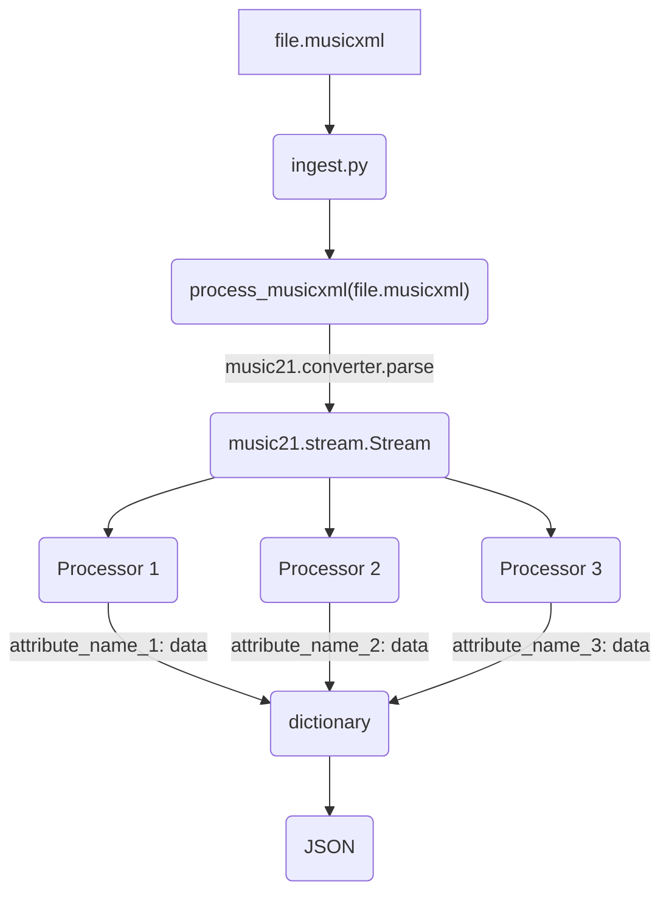

<!-- TOC -->
* [Installation](#installation)
* [Usage](#usage)
* [Pipeline](#pipeline)
  * [MusicXML processing](#musicxml-processing)
  * [Audio processing](#audio-processing)
<!-- TOC -->

# Installation
This projects uses Python 3.10 as specified in the `pyproject.toml` file. You can use `poetry` to install it.
Please refer to [this link](https://python-poetry.org/docs/#installation) to install `poetry`. To install all the dependencies, run 
```bash 
poetry install
``` 
in the root directory of the project.

# Usage
First you must configure the `.env` file. You can copy the `.env.example` file and fill in the values. 
The `ELASTIC_HOST` specifies the URL of the ElasticSearch server. `ELASTIC_USER` and `ELASTIC_PASSWORD` are the credentials to access the server.

The source files must first be ingested and transformed into appropriate JSON files. This is done by running
```bash
python ingest.py ingest
``` 
For available options, run 
```bash
python ingest.py ingest --help
``` 
We also support providing a config using a `.yaml`. Refer to the
`ingest.yaml.example` file for an example of how to use it.

While ingesting the files you must specify the `corpus_id` of the corpus you want to ingest the files into. This is done by providing the `--corpus-id` option.
If you want to list all the available corpuses, you can run 
```bash
python ingest.py list-corpuses
```
If you want to create a new one, you can run 
```bash
python ingest.py create-corpus <index> <corpus_name>
```

After ingesting the files, you can insert them into the ElasticSearch server by running `python ingest.py upload`.

Any other options for the specific command can be found by running `python ingest.py <command> --help`.

# Pipeline
This is the main processing pipeline that turns musicXML or audio files into usable data that can be inserted into ES(ElasticSearch).

## MusicXML processing


Any distinct type of data is output of a processor. For example, if you want to get the key signature of a song, make a class
called `KeySignatureProcessor` and make it inherit from `MusicXMLProcessor`. Then set the name and add it to the list of processors to be used when processing musicXML files (`music_xml_processors` in `ingest.py`). 

Each processor defines a `process` function which needs to output some type of data. It should be data that can be serialized into JSON like dictionaries, arrays and primitives.

We already have a lot of processors written so you can just copy the simpler ones and tune it to your liking.

So if we set the name of our `KeySignatureProcessor` to `key_signature`, then the output in the JSON will look like this:
```json
{
    ...
    "key_signature": "C Major",
    ...
}
```

Each processor should also define `self.mapping` in the constructor. This is a dictionary that maps the attribute name to the data type.
It follows the format for Elastic Search mapping which you can learn more about [here](https://www.elastic.co/guide/en/elasticsearch/reference/current/explicit-mapping.html).

## Audio processing
The data flow is identical to the musicXML processing. The only difference is that the input is an audio file.
By default, the `ingest` command will use the `audio_processors` list to process any files that don't have a `.musicxml` or `.xml` extension.

To add a new audio processor, you can follow the same steps as for the musicXML processors. The only difference is that you should inherit from `AudioProcessor` instead of `MusicXMLProcessor`.
The `song` parameter in the constructor now gets a path to the audio file.


