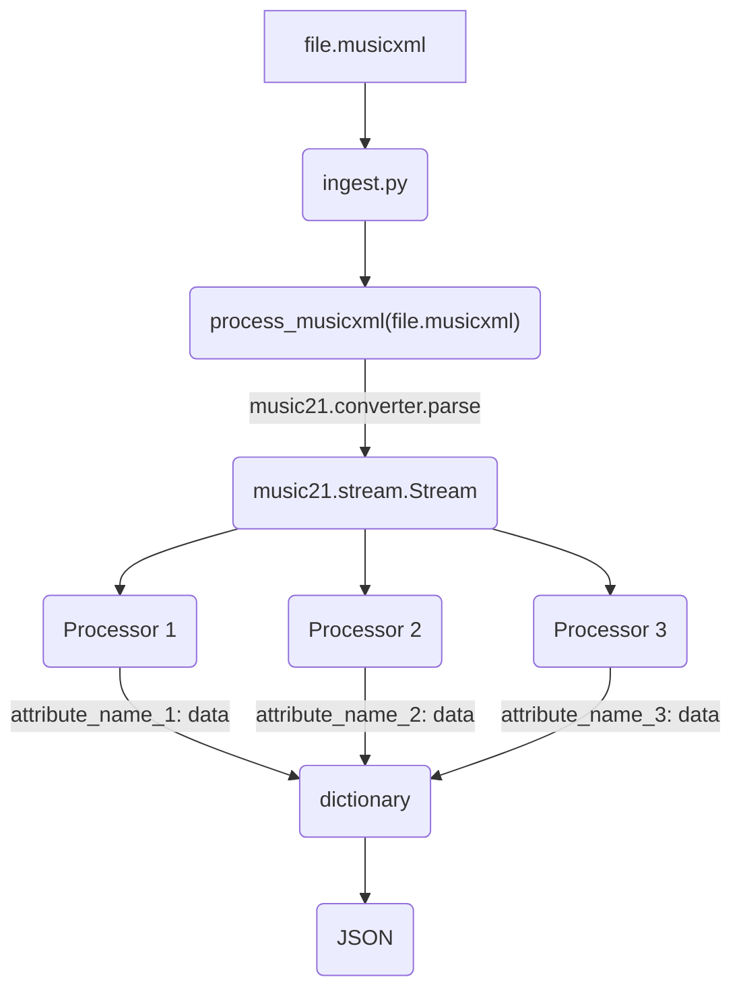

# Pipeline
This is the main processing pipeline that turns musicXML or audio files into usable data that can be inserted into ES.

## MusicXML processing

```mermaid
flowchart TD
    A[file.musicxml] --> B1(ingest.py)
    B1 --> B2("process_musicxml(file.musicxml)")
    B2 --> |music21.converter.parse| B(music21.stream.Stream)
    B --> C(Processor 1)
    B --> D(Processor 2)
    B --> E(Processor 3)
    C -->|attribute_name_1: data| F(dictionary)
    D -->|attribute_name_2: data| F
    E -->|attribute_name_3: data| F
    F --> J(JSON)
```