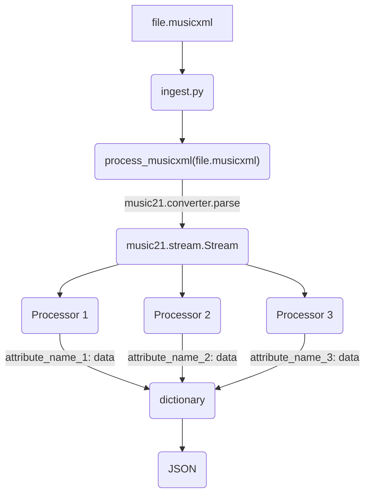

# Pipeline
This is the main processing pipeline that turns musicXML or audio files into usable data that can be inserted into ES.

The `ingest.py` file is the main script to run if you want JSON output ready to be inserted into ES.

## MusicXML processing


Any distinct type of data is output of a processor. For example, if you want to get the key signature of a song, make a class
called `KeySignatureProcessor` and make it inherit from `MusicXMLProcessor`. Then set the name and add it to the list of processors to be used when processing musicXML files (`music_xml_processors` in `ingest.py`). 

Each processor defines a `process` function which needs to output some type of data. It should be data that can be serialized into JSON like dictionaries, arrays and primitives.

We already have a lot of processors written so you can just copy the simpler ones and tune it to your liking.

So if we set the name of our `KeySignatureProcessor` to `key_signature`, then the output in the JSON will look like this:
```json
{
    ...
    "key_signature": "C Major",
    ...
}
```