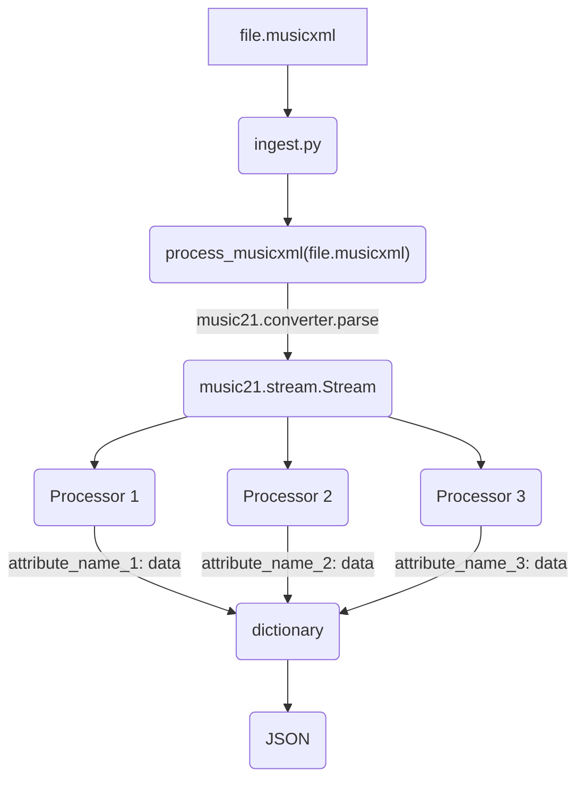

<!-- TOC -->
* [Installation](#installation)
  * [Default installation](#default-installation)
  * [In case of CUDA errors](#in-case-of-cuda-errors)
* [Usage](#usage)
* [Pipeline](#pipeline)
  * [MusicXML processing](#musicxml-processing)
  * [Audio processing](#audio-processing)
* [Development](#development)
  * [Setup](#setup)
<!-- TOC -->

# Installation
## Default installation
Please refer to [this link](https://python-poetry.org/docs/#installation) to install `poetry`. To install all the dependencies, run
```bash 
sudo apt install ffmpeg
pip wheel "vamp (==1.1.0)"
pip install vamp==1.1.0 --no-binary :all:
poetry install
``` 

## In case of CUDA errors
If you ware getting various CUDA errors while running ingest.py, follow these steps to install the dependencies.

First install CUDA 11 and cuDNN 8(for CUDA 11) by following instructions on these two links:
- [CUDA 11](https://developer.nvidia.com/cuda-11-8-0-download-archive)
- [cuDNN 8](https://developer.nvidia.com/rdp/cudnn-archive)[test-mp3](..%2Ftest-mp3)
Be sure to run the `sudo apt install cuda-11-8` instead of `sudo apt install cuda` to install the correct version of CUDA.

Because of some bugs when it comes to installing the `essentia` and `autochord` packages in a virtual environment, you should first install 
it globally by running:
```bash
pip install essentia
pip install autochord
```
To use the system-wide install then create a virtual environment manually and use the `--system-site-packages` option. 
```bash
python -m venv --system-site-packages .venv
source .venv/bin/activate
```

Then you can use the `poetry` package manager to install the rest of the dependencies.
Please refer to [this link](https://python-poetry.org/docs/#installation) to install `poetry`. To install all the dependencies, run 
```bash 
pip wheel "vamp (==1.1.0)"
pip install vamp==1.1.0 --no-binary :all:
poetry install
``` 
in the root directory of the project.

# Usage
First you must configure the `.env` file. You can copy the `.env.example` file and fill in the values. 
The `ELASTIC_HOST` specifies the URL of the ElasticSearch server. `ELASTIC_USER` and `ELASTIC_PASSWORD` are the credentials to access the server.

## Preprocessing
If you are not working with audio files, you can skip this step. 
If you are working with audio files, you must first preprocess them. 

First, you must extract the stems from the audio files. Refer to [extract_voice.md](extract_voice.md) for more information 
on how to do this. After you have extracted the stems run the following command to preprocess the files:
```bash
python ingest.py preprocess <in_dir> <out_dir>
```
This will shorten all your files to sub-10 minute clips, downsample them to 16kHz and convert them to MP3. Now you 
can continue with the rest of the pipeline.

## Ingesting

The source files must first be ingested and transformed into appropriate JSON files that contain
the data of our analysis. This is done by running
```bash
python ingest.py process
``` 
For available options, run 
```bash
python ingest.py ingest --help
``` 
We also support providing a config using a `.yaml`. Refer to the
`ingest.yaml.example` file for an example of how to use it.

While ingesting the files you must specify the `corpus_id` of the corpus you want to ingest the files into. This is done by providing the `--corpus-id` option.
If you want to list all the available corpuses, you can run 
```bash
python ingest.py list-corpuses
```
If you want to create a new one, you can run 
```bash
python ingest.py create-corpus <index> <corpus_name>
```

After ingesting the files, you must then also generate the mapping that will be used in ES to specify the structure
of the data. This is done by running
```bash
python ingest.py generate-mapping <output_file> [audio|musicxml]
```

After ingesting the files, you can insert them into the ElasticSearch server by running `python ingest.py upload`.

Any other options for the specific command can be found by running `python ingest.py <command> --help`.

## Errors

### `SSLError([Errno 13] Permission denied))`
This means you have the wrong permissions set on the `certs` folder in the root directory of the repo.
Fix this by running:
```bash
sudo chmod 777 -R certs/ca/ca.crt
```


# Pipeline
This is the main processing pipeline that turns musicXML or audio files into usable data that can be inserted into ES(ElasticSearch).

## MusicXML processing


Any distinct type of data is output of a processor. For example, if you want to get the key signature of a song, make a class
called `KeySignatureProcessor` and make it inherit from `MusicXMLProcessor`. Then set the name and add it to the list of processors to be used when processing musicXML files (`music_xml_processors` in `ingest.py`). 

Each processor defines a `process` function which needs to output some type of data. It should be data that can be serialized into JSON like dictionaries, arrays and primitives.

We already have a lot of processors written so you can just copy the simpler ones and tune it to your liking.

So if we set the name of our `KeySignatureProcessor` to `key_signature`, then the output in the JSON will look like this:
```json
{
    ...
    "key_signature": "C Major",
    ...
}
```

Each processor should also define `self.mapping` in the constructor. This is a dictionary that maps the attribute name to the data type.
It follows the format for Elastic Search mapping which you can learn more about [here](https://www.elastic.co/guide/en/elasticsearch/reference/current/explicit-mapping.html).

## Audio processing
The data flow is identical to the musicXML processing. The only difference is that the input is an audio file.
By default, the `ingest` command will use the `audio_processors` list to process any files that don't have a `.musicxml` or `.xml` extension.

To add a new audio processor, you can follow the same steps as for the musicXML processors. The only difference is that you should inherit from `AudioProcessor` instead of `MusicXMLProcessor`.
The `song` parameter in the constructor now gets a path to the audio file.

# Development

## Setup
We use `pre-commit` to enforce some development rules. To install it, run
```bash
pre-commit install
```
This will install the hooks and run them on every commit. If you want to run them manually, you can run
```bash
pre-commit run --all-files
```
If you are not using Git in a CLI, please run the hooks manually before pushing your changes.

You can also run the checks manually by running
```bash
ruff check .
ruff format .
```

## Testing
To run the tests, you can run
```bash
pytest
```
This will run all the tests in the `tests` directory. This projects uses `syrupy` to generate snapshots for complex
data outputs. If you want to update the snapshots, you can run
```bash
pytest --snapshot-update
```